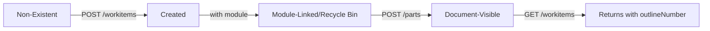

# Mock Implementation Specification: WorkItem-Document Integration

## Overview

This specification defines how the Polarion Mock must implement the WorkItem-Document integration to accurately replicate production Polarion's behavior. The mock MUST enforce the mandatory two-step process for making WorkItems visible in documents.

## Core Requirements

### 1. WorkItem State Management

The mock must track THREE states for each WorkItem:

1. **Created** - WorkItem exists in the system
2. **Module-Linked** - WorkItem has a module relationship to a document
3. **Document-Visible** - WorkItem has been added as a document part

### 2. Data Model

```python
class WorkItem:
    """Mock WorkItem model"""
    id: str  # e.g., "Python/PYTH-1234"
    type: str  # e.g., "requirement", "heading", "information"
    attributes: Dict[str, Any]
    relationships: Dict[str, Any]
    
    # Mock-specific tracking
    _is_in_document: bool = False  # Tracks if document part was created
    _outline_number: Optional[str] = None  # Auto-assigned when in document
    _document_position: Optional[int] = None  # Position in document
    _parent_workitem_id: Optional[str] = None  # Parent in hierarchy

class DocumentPart:
    """Mock Document Part model"""
    id: str  # e.g., "Python/Functional Layer/Functional Concept/workitem_PYTH-1234"
    type: str  # "workitem" or "heading"
    workitem_id: str  # Reference to WorkItem
    position: int  # Order in document
    previous_part_id: Optional[str] = None
```

## API Endpoint Implementations

### 1. POST /projects/{projectId}/workitems

**Behavior:**
- Creates WorkItem with state `Created`
- If `module` relationship provided, sets state to `Module-Linked`
- Does NOT set `_is_in_document` to True
- Does NOT assign `_outline_number`
- Returns minimal response (id, type, links only)

**Implementation:**
```python
def create_workitem(request_data):
    workitem = WorkItem(
        id=generate_workitem_id(),
        type=request_data["data"]["attributes"]["type"],
        attributes=request_data["data"]["attributes"],
        relationships=request_data["data"]["relationships"]
    )
    
    # Critical: Do NOT set these
    workitem._is_in_document = False
    workitem._outline_number = None
    
    # Store in "Recycle Bin" state
    store_workitem(workitem, in_recycle_bin=True)
    
    # Return minimal response (Polarion behavior)
    return {
        "data": [{
            "id": workitem.id,
            "type": "workitems",
            "links": {"self": f"/workitems/{workitem.id}"}
        }]
    }
```

### 2. POST /projects/{projectId}/spaces/{spaceId}/documents/{documentName}/parts

**Behavior:**
- Moves WorkItem from "Recycle Bin" to document
- Assigns `_outline_number` based on position
- Sets `_is_in_document` to True
- Creates DocumentPart entry

**Implementation:**
```python
def add_document_part(request_data):
    part_data = request_data["data"][0]
    workitem_id = part_data["relationships"]["workItem"]["data"]["id"]
    
    # Retrieve WorkItem
    workitem = get_workitem(workitem_id)
    if not workitem:
        return error_response(404, "WorkItem not found")
    
    # Check module relationship matches document
    module = workitem.relationships.get("module", {}).get("data", {})
    expected_doc_id = f"{project_id}/{space_id}/{document_name}"
    if module.get("id") != expected_doc_id:
        return error_response(400, "WorkItem module does not match document")
    
    # Create document part
    position = calculate_position(part_data.get("relationships", {}).get("previousPart"))
    
    document_part = DocumentPart(
        id=f"{expected_doc_id}/workitem_{workitem.id.split('/')[-1]}",
        type="workitem",
        workitem_id=workitem_id,
        position=position
    )
    
    # Update WorkItem state
    workitem._is_in_document = True
    workitem._outline_number = generate_outline_number(position, workitem.type)
    workitem._document_position = position
    
    # Move from Recycle Bin to Document
    move_from_recycle_bin(workitem)
    store_document_part(document_part)
    
    return {
        "data": [{
            "type": "document_parts",
            "id": document_part.id,
            "links": {"self": f"/parts/{document_part.id}"}
        }]
    }
```

### 3. GET /projects/{projectId}/workitems/{workItemId}

**Behavior:**
- Returns full WorkItem data
- Includes `outlineNumber` ONLY if `_is_in_document` is True
- Shows correct module relationship

**Implementation:**
```python
def get_workitem(workitem_id):
    workitem = retrieve_workitem(workitem_id)
    
    response = {
        "data": {
            "type": "workitems",
            "id": workitem.id,
            "attributes": {
                **workitem.attributes,
                # Only include outlineNumber if in document
                **({"outlineNumber": workitem._outline_number} 
                   if workitem._is_in_document and workitem._outline_number 
                   else {})
            },
            "relationships": workitem.relationships
        }
    }
    
    return response
```

### 4. GET /projects/{projectId}/spaces/{spaceId}/documents/{documentName}/parts

**Behavior:**
- Returns all document parts in order
- Includes both heading and workitem parts
- Shows proper hierarchy

**Implementation:**
```python
def get_document_parts(project_id, space_id, document_name):
    doc_id = f"{project_id}/{space_id}/{document_name}"
    parts = get_all_document_parts(doc_id)
    
    # Sort by position
    parts.sort(key=lambda p: p.position)
    
    response_parts = []
    for part in parts:
        if part.type == "workitem":
            # Check if WorkItem is actually in document
            workitem = get_workitem(part.workitem_id)
            if workitem and workitem._is_in_document:
                response_parts.append({
                    "type": "document_parts",
                    "id": part.id,
                    "links": {"self": f"/parts/{part.id}"}
                })
        elif part.type == "heading":
            response_parts.append({
                "type": "document_parts",
                "id": part.id,
                "links": {"self": f"/parts/{part.id}"}
            })
    
    return {"data": response_parts}
```

### 5. POST /projects/{projectId}/workitems/{workItemId}/linkedworkitems

**Behavior:**
- Creates parent-child relationships
- Does NOT affect document visibility
- Updates hierarchy tracking

**Implementation:**
```python
def create_linked_workitem(workitem_id, request_data):
    link_data = request_data["data"][0]
    parent_id = link_data["relationships"]["workItem"]["data"]["id"]
    
    # Create relationship
    create_parent_child_link(
        child_id=workitem_id,
        parent_id=parent_id,
        role=link_data["attributes"]["role"]
    )
    
    # Important: This does NOT make WorkItem visible in document
    # That still requires the document parts API call
    
    return {"data": [{"type": "linkedworkitems", "id": f"{workitem_id}/parent/{parent_id}"}]}
```

## Validation Rules

### 1. outlineNumber Assignment Rules

```python
def generate_outline_number(position, workitem_type, parent_outline=None):
    """
    Generate outline number based on document position and hierarchy
    """
    if parent_outline:
        # Child of another WorkItem
        return f"{parent_outline}-{position}"
    elif workitem_type == "heading":
        # Top-level heading
        return calculate_section_number(position)  # e.g., "1.2"
    else:
        # Regular WorkItem in document
        return f"FC-{calculate_section(position)}-{position}"  # e.g., "FC-1.2-3"
```

### 2. Module Relationship Validation

```python
def validate_module_relationship(workitem, target_document):
    """
    Ensure WorkItem's module matches the target document
    """
    module = workitem.relationships.get("module", {}).get("data", {})
    if not module:
        raise ValidationError("WorkItem has no module relationship")
    
    if module.get("id") != target_document:
        raise ValidationError(f"Module {module.get('id')} does not match {target_document}")
```

## Error Scenarios

### 1. Attempting to Set outlineNumber
```python
if "outlineNumber" in request_data["data"]["attributes"]:
    return {
        "errors": [{
            "status": "400",
            "title": "Bad Request",
            "detail": "Cannot modify read-only field(s): outlineNumber"
        }]
    }
```

### 2. Adding Document Part for Non-Existent WorkItem
```python
if not workitem_exists(workitem_id):
    return {
        "errors": [{
            "status": "404",
            "title": "Not Found",
            "detail": f"WorkItem {workitem_id} not found"
        }]
    }
```

### 3. Module Mismatch
```python
if workitem_module != target_document:
    return {
        "errors": [{
            "status": "400",
            "title": "Bad Request",
            "detail": "WorkItem module does not match target document"
        }]
    }
```

## State Transitions



## Testing Requirements

### Test Case 1: Two-Step Process
```python
def test_two_step_process():
    # Step 1: Create WorkItem
    response1 = create_workitem(workitem_data)
    assert response1.status_code == 201
    wi_id = response1.json()["data"][0]["id"]
    
    # Verify: No outlineNumber yet
    get_response = get_workitem(wi_id)
    assert "outlineNumber" not in get_response.json()["data"]["attributes"]
    
    # Step 2: Add to document
    response2 = add_document_part(wi_id, space, document)
    assert response2.status_code == 201
    
    # Verify: Now has outlineNumber
    get_response2 = get_workitem(wi_id)
    assert "outlineNumber" in get_response2.json()["data"]["attributes"]
```

### Test Case 2: Reject outlineNumber Setting
```python
def test_reject_outline_number():
    workitem_data = {
        "data": {
            "attributes": {
                "outlineNumber": "1.2.3"  # This should fail
            }
        }
    }
    
    response = create_workitem(workitem_data)
    assert response.status_code == 400
    assert "Cannot modify read-only field(s): outlineNumber" in response.text
```

### Test Case 3: Document Parts Visibility
```python
def test_document_parts_visibility():
    # Create WorkItem but don't add to document
    wi1 = create_workitem(data1)
    
    # Create and add another WorkItem to document
    wi2 = create_workitem(data2)
    add_document_part(wi2["data"][0]["id"])
    
    # Get document parts
    parts = get_document_parts(project, space, document)
    part_ids = [p["id"] for p in parts.json()["data"]]
    
    # Only wi2 should be in document parts
    assert f"workitem_{wi2['data'][0]['id'].split('/')[-1]}" in str(part_ids)
    assert f"workitem_{wi1['data'][0]['id'].split('/')[-1]}" not in str(part_ids)
```

## Mock-Specific Features

### 1. Recycle Bin Tracking
```python
class MockRecycleBin:
    """Track WorkItems in Recycle Bin state"""
    def __init__(self):
        self.items = {}  # workitem_id -> WorkItem
    
    def add(self, workitem):
        if workitem.relationships.get("module") and not workitem._is_in_document:
            self.items[workitem.id] = workitem
    
    def remove(self, workitem_id):
        if workitem_id in self.items:
            del self.items[workitem_id]
    
    def list_for_document(self, document_id):
        return [wi for wi in self.items.values() 
                if wi.relationships.get("module", {}).get("data", {}).get("id") == document_id]
```

### 2. Debug Endpoints (Mock Only)
```python
# GET /mock/debug/recycle-bin/{documentId}
def get_recycle_bin_items(document_id):
    """List all WorkItems in document's Recycle Bin"""
    return {"data": recycle_bin.list_for_document(document_id)}

# GET /mock/debug/workitem-states/{workItemId}
def get_workitem_state(workitem_id):
    """Show internal state of a WorkItem"""
    wi = get_workitem(workitem_id)
    return {
        "id": wi.id,
        "in_document": wi._is_in_document,
        "outline_number": wi._outline_number,
        "document_position": wi._document_position,
        "in_recycle_bin": workitem_id in recycle_bin.items
    }
```

## Implementation Checklist

- [ ] WorkItem model with state tracking fields
- [ ] DocumentPart model with position tracking
- [ ] Recycle Bin implementation
- [ ] Two-step process enforcement
- [ ] outlineNumber auto-generation (never manual)
- [ ] Module relationship validation
- [ ] Document parts ordering
- [ ] Parent-child relationship handling
- [ ] Error responses matching Polarion
- [ ] Debug endpoints for testing
- [ ] State transition tracking
- [ ] Test suite covering all scenarios

## Summary

The mock MUST replicate Polarion's two-step process exactly:
1. WorkItem creation puts items in "Recycle Bin" (not visible)
2. Document Part addition makes items visible with auto-assigned outlineNumber
3. outlineNumber is ALWAYS read-only
4. Parent-child relationships are separate from document visibility
5. Module relationship must match target document